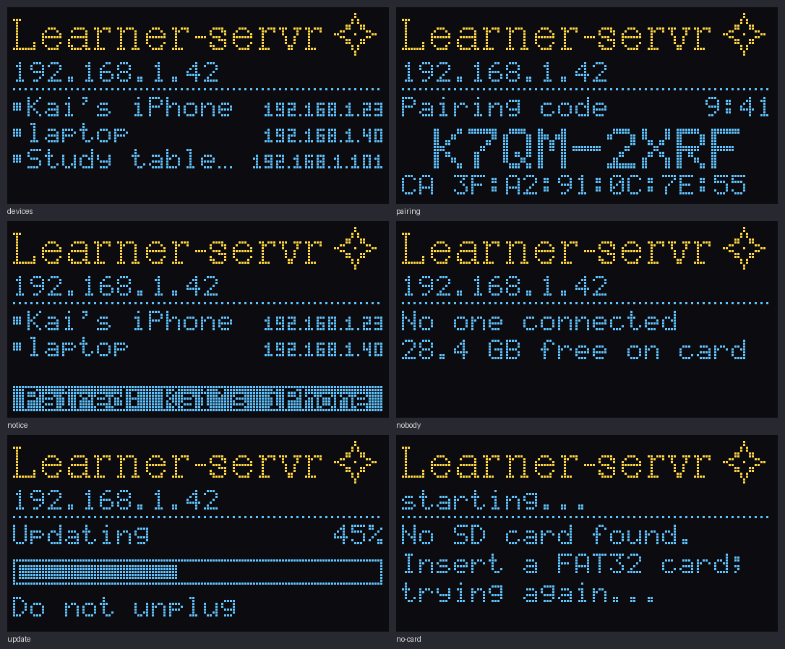
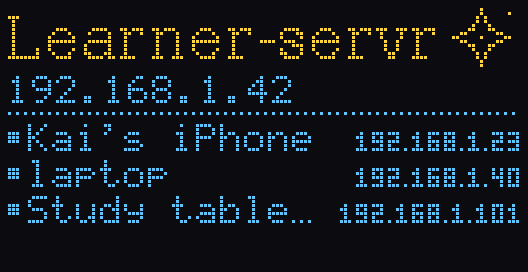
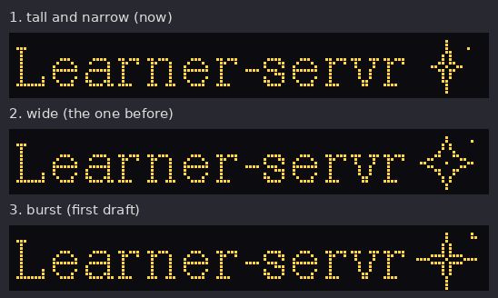
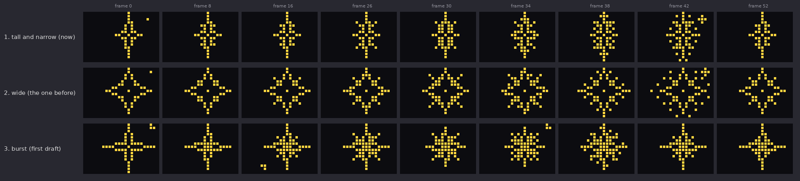

# Learner-servr on LilyGO T3 boards

The hub's server running on an ESP32 board, with the documents on a microSD card of up to 32 GB and a status screen. Two boards: the **T3 LoRa32 V1.6.1** (ESP32) and the **T3-S3 V1.3** (ESP32-S3 with 2 MB PSRAM). Same server code as on a computer (`../src`); this folder adds what only the board needs. Branch: `claude/esp32-32gb-memory-efficiency-n3dz1c`. Its plan, with every request made on the branch, is [TODO.md](TODO.md); its review [REVIEW.md](REVIEW.md); whether it is built the right way, [ARCHITECTURE.md](ARCHITECTURE.md).

**Not yet run on a board.** Everything here builds (ESP-IDF 5.4.1) and the server parts are tested on a computer with the board's settings (`--profile esp32`); the board-only parts (screen, Wi-Fi, card, updates) are checked by compiling and reading, not by running. The first flash is where they meet the hardware.

## The boards

| | T3 LoRa32 V1.6.1 | T3-S3 V1.3 (and V1.2) |
|---|---|---|
| Chip | ESP32-PICO-D4, 2 cores, 240 MHz | ESP32-S3FH4R2, 2 cores, 240 MHz |
| Memory | 520 KB, roughly 150 to 200 KB free once Wi-Fi and TLS are up; no PSRAM | 512 KB, and 2 MB PSRAM |
| Flash | 4 MB | 4 MB |
| microSD (SPI) | MOSI 15, MISO 2, SCK 14, CS 13 | MOSI 11, MISO 2, SCK 14, CS 13 |
| OLED, 0.96" SSD1306 (I2C, 0x3C/0x3D, no reset pin) | SDA 21, SCL 22 | SDA 18, SCL 17 |
| Buttons | RESET | RESET, BOOT (GPIO 0): shows the board's details on the screen |
| LED, battery | 25, ADC 35 (not used yet) | 37, ADC 1 (not used yet) |
| USB | through a USB-serial chip | the chip's own USB, on USB-C |
| Profile (limits) | `esp32`: 4 connections at once, 6 open pages | `esp32-psram`: 8 connections, 12 open pages, page and scripts kept in memory |

Pins from LilyGO's own board definitions; `main/board_pins.h` picks them by chip, so there is nothing to choose but the build target. The LoRa radio on both (SX1276 on the V1.6.1, SX1262 at 915 MHz on yours) is left alone.

On the V1.6.1, GPIO 2 is also a boot-mode pin: if flashing fails with a card in, take the card out while flashing. GPIO 16, which other boards use to reset the OLED, belongs to the PICO-D4's own flash and is never touched. On the T3-S3, if flashing over USB-C does not start, hold BOOT while plugging it in.

## The screen





- Top: **Learner-servr** in serif (DejaVu Serif, drawn to pixels by `tools/make-title.py`) and the star, in thin lines, tall and narrow: a hollow four-pointed star whose short diagonal rays grow and fall back, a tall dotted diamond opening as they peak, a spark at its side. About five seconds a cycle. Two other designs are kept to compare (below, "Choosing the star").
- On the T3-S3, the BOOT button wakes the screen and shows, for eight seconds, the board, the firmware version, how long it has been up, and free memory (internal and PSRAM).
- Under it, the address to type: the board's IP (and port if not 443), every few seconds `hub.local` instead.
- The rest: devices with a page open (●) or heard from in the last two minutes (○), name and IP, four at a time (when every address shares its start with the board's, as 192.168… does at home, only what follows is shown: "1.23" for 192.168.1.23, and the board's own address above shows the rest); while a **pairing code** is on offer, the code large, the time left, and the start of the certificate authority's fingerprint to compare with the trust page; during an update, a progress bar; at start-up and when something is wrong, what is happening and what to do.
- Bottom line, reversed, for a few seconds: what just happened ("Paired: Kai's iPhone", "Removed: …", "Storage is full"), or until it is over, "Wi-Fi lost: rejoining".

After ten minutes with nothing new it dims: an OLED wears where it stays lit. What moves by itself (the star, the address and name taking turns, the device pages turning over) does not count as new. Only the bytes that changed are sent each frame (the star: a few dozen; a full screen is a kilobyte), from a task below the server in priority.

### Choosing the star

Three designs, one file each; only the chosen one is built into the firmware (all three with "take turns"):





| | File | What it does |
|---|---|---|
| 1 | `main/star_tall.hpp` | **Tall and narrow**, the one in use: a hollow four-pointed star, short diagonal rays, a tall dotted diamond |
| 2 | `main/star_wide.hpp` | **Wide**, the one before it: as wide as it is tall; the rays make it an eight-pointed compass star for a moment, the diamond opens square |
| 3 | `main/star_burst.hpp` | **Burst**, the first draft: a breathing four-pointed star, a smaller one turned an eighth growing out of it, a dotted ring, sparks at opposite corners |

To pick one: menuconfig, Hub, "Star beside the title" (`idf.py -B build-esp32 -D SDKCONFIG=build-esp32/sdkconfig menuconfig`, then build and flash). "Take turns" shows all three on the board, one cycle each (tall, wide, burst, about five seconds each), to judge them on the real screen, where a pixel looks different from in a picture. For PlatformIO, uncomment the `CONFIG_HUB_STAR_…` define in `platformio.ini`. Once you have chosen, the other two files can stay or go: delete one and take its line out of `draw_star` in `main/screen_draw.hpp`.

To change the layout or a star, edit `main/screen_draw.hpp` or the star's file and look at it on a computer first:

```
c++ -std=c++17 -I main -I ../src tools/screen-preview.cpp -o /tmp/screen-preview && /tmp/screen-preview /tmp/screens
```

It writes each screen, and every frame of each star (`star-tall-00.png` … `star-burst-63.png`). Add `-DCONFIG_HUB_STAR_WIDE` (or `_BURST`) to the first command to see the screens with that star.

An SH1106 instead of an SSD1306 (some clones), or a screen upside down: menuconfig, Hub ("The OLED is an SH1106", "mounted the other way up"); for PlatformIO the two defines at the bottom of `platformio.ini`.

## Preparing the card

A FAT32 card. Cards up to 32 GB (SDHC) come formatted FAT32; larger ones (SDXC) come as exFAT, which this build does not read: reformat as FAT32 or use 32 GB.

```
make -C .. card CARD=/Volumes/<the card>      # the reader page, into hub/www
```

then put your documents in `hub/` beside `www/`, and, at the top of the card (not inside `hub/`), a file `wifi.txt`:

```
ssid=Your network
password=its password
name=hub
```

At start-up the board copies the network into its own flash and the name into its settings, then **deletes `wifi.txt`** from the card, so the password does not travel with a card that goes in and out of other computers. To change network, put a new `wifi.txt` on the card. `name` is optional (`hub` if left out): the board is then `hub.local` on the network. The top of the card is outside what the server shows, so the file is never served.

## Building and flashing

ESP-IDF 5.4 (the build this branch is checked with):

```
. $IDF_PATH/export.sh
cd server-cpp/esp32
idf.py set-target esp32    # the T3 V1.6.1;  esp32s3 for the T3-S3
idf.py menuconfig          # Hub: name, update repository (Wi-Fi only if you will not use wifi.txt)
idf.py -p /dev/cu.usbserial-XXXX flash monitor     # T3-S3: the port is /dev/cu.usbmodem…
```

`set-target` starts the configuration afresh; for the T3-S3 it also applies `sdkconfig.defaults.esp32s3` (PSRAM on, TLS buffers in PSRAM, logs on the USB-C port). Each board needs its own build of the firmware, and its own releases if you use updates (see "Updates": publish one per board, or one repository each).

The first build fetches the mDNS component (`main/idf_component.yml`); without the internet it builds without it, and the board is then reachable by IP only.

PlatformIO (needs Arduino-ESP32 3.x; see the top of `platformio.ini`):

```
pio run -d server-cpp/esp32 -e t3 -t upload && pio device monitor -d server-cpp/esp32      # -e t3s3 for the T3-S3
```

**This branch changes the partition table**: two program slots of 1.75 MB for updates (the program is about 1.4 MB, with the server side of books, files of links and anchors, and mDNS), and a smaller state partition (448 KB) for the certificates and the paired devices. The table only changes over USB: flash once by cable (`idf.py flash` writes it), after which updates can come over the network. Paired devices and the certificate authority start afresh with the new table (the old one's firmware never built for the board, so no board should have any).

## Connecting

**Home Wi-Fi.** The board joins as an ordinary device (station), with `wifi.txt` or the build's settings. If the network cannot be joined, the screen says so after 20 seconds and keeps trying.

**A name instead of a number.** Three ways, from least to most work:

1. `hub.local` (or whatever `name=` says): the board announces itself by mDNS. Works out of the box on iPhone, iPad, Mac, Windows 10 and later, Linux; on Android, Chrome resolves `.local` on recent versions, older ones may not. Nothing to set up. The certificate already covers `hub.local`.
2. Your router: reserve an address for the board (DHCP reservation, so the IP stays the same), and many routers also make its name (`hub`, sent as the DHCP host name) resolvable as `hub` or `hub.lan` / `hub.home`. The certificate covers `.local` names and home-network addresses; for a router name, see 3.
3. A real domain name (`learner.example.com`): an A record pointing at the board's home address (a private one, `192.168.x.y`, is fine: it only works at home, which is the point). Some routers block public names that resolve to private addresses ("DNS rebinding protection"); allow that one name. The hub's certificate authority is limited on purpose to `.local`, the names the board had when the authority was made, and home addresses (`../API.md`, Security): a new name needs a new authority made with that name (`--allow-host` and `--new-authority` on a computer; on the board, adding `--allow-host` to the arguments in `board.cpp`), and every device then installs the new authority once.

**From outside the home.** Do not forward a port from the internet to the board: it would face every scanner on the internet with a few hundred KB of memory. Run a VPN on the router (WireGuard is common) or on an always-on computer, and reach the board as if at home.

## More devices at once

What limits it is memory. Each HTTPS connection being served needs about 30 KB at its peak (a 16 KB buffer for an incoming TLS record, a 4 KB one going out, a 12 KB thread stack); a page left open, listening for changes, costs little once loaded (a socket and an idle TLS session, a few KB), because its thread has finished.

- The board serves 4 connections at a time. **More now wait instead of being turned away**: the server leaves them in the listening queue until a place frees up, so a browser opening a page with seven files gets them all, a little later, rather than an error.
- Before taking in another, it checks there is memory for it (48 KB free, of which a 20 KB block in one piece); one connection is always let in.
- Up to **6 pages** may be open and listening (was 2), and the network stack has 16 sockets (was 10).
- `GET /api/device` on the board reports `heapFree`, `heapLeast` (the lowest since start-up) and `heapLargest`: open the reader on several devices and watch these to see how far it goes. If `heapLeast` stays well above 60 KB, `max_conns` in the `esp32` profile (`../src/hub.cpp`) can go up.

The way past this is to stop giving every connection a thread of its own (TODO.md, "an event loop").

## Updates from GitHub

The board can install new firmware by itself from your repository's releases: two minutes after starting, then once a day (menuconfig: Hub). It is off until you set it up, and set up it only accepts firmware **you signed**.

How it decides (all in `main/update.cpp`):

- Each release carries, for each kind of board, an image and a manifest (`hub-esp32.bin` and `hub-firmware-esp32.json` for the T3 V1.6.1, `…-esp32s3…` for the T3-S3): the chip, the version, the SHA-256 of the image, and an ECDSA signature over all three, made on your computer. A board fetches only its own chip's, and the chip is inside the signature, so one board's image cannot be passed to the other. The board holds only the public half of the key (`main/update_key.h`). Someone who takes over the GitHub account or the network can offer anything; the board installs nothing that is not signed by your key.
- The version is inside the signature and must be higher than the running one: an old release, signed but with a known fault, cannot be pushed back onto it.
- The new image goes into the other program slot; the running one stays. After restarting into it, the board keeps it only once the server has served for a minute; if it crashes or cannot start first, the bootloader goes back to the previous one by itself (ESP-IDF build: `CONFIG_BOOTLOADER_APP_ROLLBACK_ENABLE`; with PlatformIO this depends on the Arduino core's bootloader).
- It waits for a moment when nobody is being served and memory is plentiful: the HTTPS connection to GitHub needs about 40 KB.

Setting it up, once:

```
cd server-cpp/esp32
tools/release.sh keys            # makes ~/.config/hub/update-signing-key.pem and writes main/update_key.h
git add main/update_key.h        # the public half: safe to commit
idf.py menuconfig                # Hub > GitHub repository with firmware releases: owner/repo
idf.py build flash               # by USB, once: now the board trusts your key
```

Keep the private key safe and out of git and CI: whoever has it can make every board install anything, and without it boards accept no more updates until reflashed by USB.

Each release:

```
# raise HUB_VERSION in main/version.h, then, for each board you have:
idf.py -B build-esp32 -D SDKCONFIG=build-esp32/sdkconfig set-target esp32 build && tools/release.sh build-esp32
idf.py -B build-esp32s3 -D SDKCONFIG=build-esp32s3/sdkconfig set-target esp32s3 build && tools/release.sh build-esp32s3
gh release create v2 build/release/* --title "Board firmware v2" --latest
```

(Each board's build keeps its own configuration, so the two do not overwrite each other's. After the first time, drop `set-target`: it starts the configuration afresh.) The board fetches `https://github.com/OWNER/REPO/releases/latest/download/hub-firmware-CHIP.json` without signing in, so **the repository's releases must be public**. If the code repository is private, publish firmware releases from a small public repository of their own and point the board at that one. Progress shows on the screen ("Updating", a bar, "Do not unplug"), and the board restarts into the new version.

## Large videos

FAT32 holds files up to 4 GB, and the board serves them whole or in pieces (seeking) up to that size; files past 2 GB are read through FatFS directly, since the board's own file functions stop at 2 GB. The board cannot shrink a video itself (re-encoding takes a desktop processor minutes); a computer can, before copying it to the card:

```
tools/shrink-video.sh lecture.mov              # -> lecture.small.mp4: H.264/AAC, 720 lines, index at the front
tools/shrink-video.sh lecture.mov out.mp4 480  # smaller still
```

"Index at the front" (`+faststart`) matters most here: the browser can start and seek with a few small requests instead of first reading the end of the file over the board's Wi-Fi. A lecture or screen recording typically comes out at a quarter to a tenth of its size.

Uploads through the reader take files up to 4 GB on both boards, the most FAT32 holds: they go to the card in pieces, so memory never limited them, only time. Expect very roughly 0.3 to 1 MB a second over Wi-Fi with HTTPS (the T3-S3 at the faster end): a 1 GB lecture is a quarter of an hour to an hour, and copying it to the card on a computer is still quicker. Use the folder button ("Upload a folder") for large files: it sends them straight from the disk. "Add files" keeps each file on the device until it is sent (so it works offline), and so takes files up to 200 MB. Whatever is left out is listed, with the reason. An upload that stops sending gives up after 30 seconds instead of holding a connection.

## Big folders

A folder of a thousand files works, within the same memory as ten: the list is written to the card as it is made, names are sorted in 32 KB with extra passes for bigger folders, and titles from the last list are reused for files that did not change. Uploading a folder of a thousand files sends them one at a time; the page that uploads asks for the list once at the end, and other open pages at most every three seconds.

FAT itself is slow at very large single folders: adding a file means searching the folder from its start for the name (and FAT's short-name scheme searches again for each of the first few names alike). Split thousands of files into subfolders of a few hundred where you can.

## Books, PDFs and files of links

Everything the reader does with them happens in the browser: the document engine runs there, and reads a book from the board a piece at a time (64 KB range requests), so a book or a PDF of any size can be read and highlighted. What the board unpacks itself is small, and limited by its memory: a book's list of files and its contents (to list its pages), and a page only when the engine is not there (an older page, another hub). On the T3 V1.6.1 each may be at most 32 KB: a book with a very long contents (hundreds of chapters) or thousands of files inside is left out of the list there, and a page over 32 KB cannot be shown without the engine. On the T3-S3, with PSRAM, 1 MB. Search looks at the first 32 KB of each document on the T3 V1.6.1 (1 MB on the T3-S3).

## When something is wrong

| Screen | What it means |
|---|---|
| No SD card found / trying again | No card, or not FAT32. It tries every 5 seconds. |
| No reader page on the card | `hub/www/index.html` missing: run `make card`. |
| No Wi-Fi settings | No `wifi.txt` and none built in. Put `wifi.txt` on the card and restart. |
| Wi-Fi not joined | Wrong name or password, or out of range. It keeps trying. |
| Wi-Fi lost: rejoining | The router went away; pages reconnect when it is back. |
| SD card removed / Restarting | The card was taken out. It restarts and waits for one. |
| The server stopped / Restarting in 30 s | The serial monitor says why (certificates, the folder). |
| This version failed / Going back | A new firmware could not start: back to the previous one. |
| Flash storage failed | The state partition would not mount: reflash by USB. |
